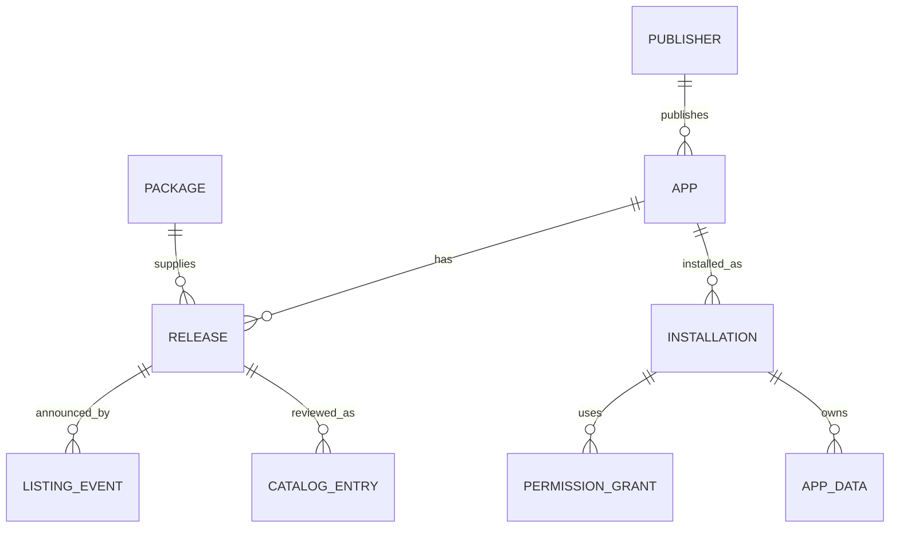

# Bitos app ecosystem data model

Status: proposed contract for the installer, Store, and Nostr catalog. `src/core/ecosystem.js` implements a preview-grade localStorage subset (installs, grants, app data) for `os-web`; package bytes, IndexedDB stores, and the package runtime are not implemented. Read with the [App Store plan](APP_STORE_PLAN.md) and [developer guide](APP_DEVELOPER_GUIDE.md).

## Entities and ownership

| Entity | Key | Owner and purpose |
| --- | --- | --- |
| Publisher | 32-byte Nostr public key, lowercase hex | Developer identity; private key stays with developer |
| App | `(publisherKey, appId)` | Stable product identity, display metadata, support and privacy links |
| Release | `(publisherKey, appId, version)` | Immutable version, compatibility, permission request, archive digest |
| Package | SHA-256 digest of exact archive bytes | Downloadable immutable bytes; may have several HTTPS mirrors |
| Listing event | Nostr event ID and `(kind, pubkey, d)` address | Signed discovery metadata and pointer to a release |
| Catalog entry | `(publisherKey, appId, version, packageDigest)` | Curator decision about one exact release |
| Installation | `(localProfileId, publisherKey, appId)` | Installed release, source, lifecycle state, and rollback pointer |
| Permission grant | `(localProfileId, publisherKey, appId, permission)` | User decision, scope, and time of grant/revocation |
| App data | `(localProfileId, publisherKey, appId, key)` | Private user data, separate from package bytes |



## Identity and normalization

- `publisherKey` is the verified event `pubkey`, never a value trusted from event content. Use lowercase 64-character hex internally; encode as `npub` only for display or sharing. An app ID is lowercase kebab-case, 1–64 characters, with no leading or trailing hyphen. The compound app key is authoritative; two publishers may use the same app ID.
- `version` follows `MAJOR.MINOR.PATCH` with optional prerelease. Compare versions semantically, not as strings. The pair `(app key, version)` maps to exactly one package digest and one permission set. If conflicting signed releases appear, quarantine that version and require publisher resolution; do not pick one by relay order.
- Digests are lowercase hex SHA-256 of exact bytes. Store them internally without a `sha256-` prefix; manifest file hashes may use that prefix. URLs are locations, never identity. Never treat a Nostr relay, catalog row, display name, or download URL as proof of publisher ownership.
- Use `localProfileId` only on the device. Do not put profile IDs, installed apps, grants, or app data into public Nostr events. The Store can browse public listings without a Nostr login.

## Records

The following shapes are illustrative JSON contracts. Field names and limits become normative when the installer schema is frozen.

```json
{
  "app": {
    "publisherKey": "<64 lowercase hex characters>",
    "appId": "example-counter",
    "name": "Example Counter",
    "summary": "A small offline counter app",
    "supportUrl": "https://example.org/support",
    "privacyUrl": "https://example.org/privacy"
  },
  "release": {
    "publisherKey": "<64 lowercase hex characters>",
    "appId": "example-counter",
    "version": "1.0.0",
    "packageDigest": "<64 lowercase hex characters>",
    "packageSize": 12345,
    "packageUrls": ["https://example.org/releases/example-counter-1.0.0.bitos-app"],
    "minBitosApi": 1,
    "permissions": [],
    "manifestDigest": "<64 lowercase hex characters>"
  }
}
```

`app.json` inside the archive carries package metadata and per-file hashes; it cannot assert its own publisher identity. Bind it to the publisher through the verified release event and package digest. On install, compare app ID, version, API level, and permissions across the signed release and manifest. A mismatch fails installation. `manifestDigest` is optional if the exact archive digest and every file are validated; keep it if reproducible manifest hashing is standardized.

### Nostr events

Use [NIP-78 `kind:30078`](https://github.com/nostr-protocol/nips/blob/master/78.md) for Bitos-specific data, with two distinct addresses under the publisher key:

| Event | `d` tag | Content |
| --- | --- | --- |
| Release | `bitos.release.<app-id>.<version>` | Immutable release record above |
| App listing | `bitos.app.<app-id>` | App metadata and `releaseAddress` for the current recommended release |

The release address is `30078:<publisherKey>:bitos.release.<app-id>.<version>`. This keeps older versions discoverable even when the app listing is replaced. Because relays may still accept a later event at the same address, the client detects any changed digest for an existing version and quarantines it. Retain verified event ID, creation time, signature, and relay sources for audit. A [NIP-94](https://github.com/nostr-protocol/nips/blob/master/94.md) file event may provide package metadata, but it is supplementary to the release record.

The Store verifies Nostr event ID and signature, checks `pubkey` against the app key, validates all bounded fields, and resolves the release address. A publisher signing a listing proves control of that key; it does not imply catalog approval or code safety.

### Catalog decision

Catalog approval is an exact tuple, never an open-ended approval of a publisher or URL. Keep a review record with `status` (`approved`, `rejected`, `withdrawn`, `revoked`), `reviewedAt`, `reviewerId`, reason code, event ID, and digest. The public catalog publishes only needed decision fields and a signed snapshot or equivalent authenticated response; reviewer notes can stay private. A revocation prevents new installs and updates and warns users with an existing installation. It does not silently erase user data.

### Local installation

Store `installedVersion`, `installedDigest`, `previousVersion`, `previousDigest`, `source` (`catalog`, `nostr-address`, `local-file`), `state` (`installing`, `ready`, `updating`, `broken`, `removing`), timestamps, and a validation result. Only a `ready` installation appears in the app launcher. Keep the previous verified package until the update has committed and started successfully. A profile can have one active release of an app, while multiple package versions may remain cached.

Permission grants are keyed by app identity, not version. On every update, compare requested permissions with existing grants; newly requested capabilities start denied and require a user decision. A revoked grant takes effect for running frames immediately. App data lives in a quota-limited namespace under the same app identity and survives code updates. On uninstall, delete package code and grants; delete app data only if the user selects that option.

## Persistence layout

For `os-web`, use one versioned IndexedDB database for metadata and package bytes. Suggested object stores:

| Store | Primary key | Indexes / notes |
| --- | --- | --- |
| `apps` | `[publisherKey, appId]` | Name is display-only |
| `releases` | `[publisherKey, appId, version]` | Unique digest per version; index by digest |
| `packages` | `packageDigest` | Blob, byte count, verification time, reference count |
| `listings` | `[publisherKey, appId]` | Verified event, release address, fetch time |
| `catalog` | `[publisherKey, appId, version, packageDigest]` | Decision and catalog snapshot ID |
| `installations` | `[localProfileId, publisherKey, appId]` | Index by lifecycle state |
| `grants` | `[localProfileId, publisherKey, appId, permission]` | Granted/denied and scope |
| `appData` | `[localProfileId, publisherKey, appId, key]` | Enforce per-app quota through host API |

Use transactions for metadata changes, staging package bytes before activating an installation. A failed download or hash check must leave the prior `ready` install intact. Keep schema migrations explicit and reversible where possible. Browser storage can be evicted; expose export/backup later rather than promising durable device storage. The booted OS should map the same logical records to its persistent user data partition and keep package bytes apart from app data; exact native paths and database choice belong to `bitos/os`.

## Lifecycle and consistency checks

1. **Discover:** ingest bounded events, validate signature and address, then cache listing/release records. Unverified data never becomes an install candidate.
2. **Select:** require catalog approval for curated results. Direct Nostr addresses and local files are explicit user actions with their source shown.
3. **Download:** fetch from an HTTPS URL with size/time limits, validate archive digest, paths, manifest, and every listed file. Reject version or permission mismatches.
4. **Install:** stage package and metadata; request new permission decisions; atomically move the installation to `ready`. Do not activate partially verified code.
5. **Update:** repeat verification, preserve prior bytes for rollback, and switch active version only after a successful start. Keep data migrations versioned.
6. **Uninstall:** stop frames, remove grants and code, and apply the user's app-data choice. Record a tombstone if needed to avoid accidental automatic reinstall.

## Still to specify before implementation

- Package container, manifest serialization, hash encoding, and size limits are frozen for v1 in [PACKAGE_FORMAT.md](PACKAGE_FORMAT.md); `manifestDigest` is not retained.
- Exact Nostr JSON schemas, event size bounds, catalog signing/transport, relay policy, and publisher key migration.
- Stable host API and permission names, quota limits, package retention, backup/export, and app data migration rules.
